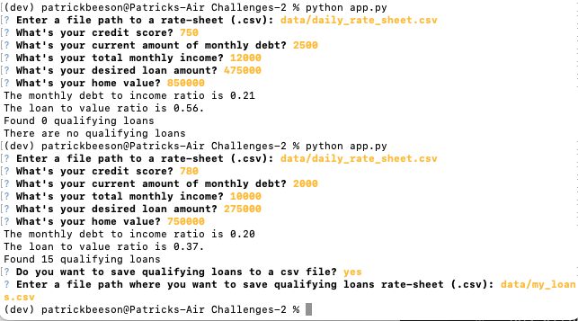

# **Loan Qualifier Application**

The Loan Qualifier Application (app) allows users to find loans from banks based on a combination of financial factors. These factors include their credit score as well as their income, desired loan size and the desired home value. 

---

## **Technologies**

The app was buildt in Python 3.7 and uses several Python 3.7 libraries including Pathlib, Fire and Questionary. The libraries allow for reading and saving csv files and for the user to input into the app the financial factors that will determine which loans they are eligible to receive. The operating system used to create this app is macOS Big Sur.

```
import sys
from pathlib import Path
import fire
import questionary
```

---

## **Installation Guide**

If you need help with installing Python 3.7 please use this link to Python guides.

[Python documentation](https://docs.python.org/3.7/)

---

## **Usage**

Answer these question to create and save your own list of quaified loans.



---

## **Contributors**

This was a student project but that had criticial contributions from the head instructor and very able TA's. 

---

## **License**

Any usage of this app should be authorized from Columbia Univesity bookcamp.


