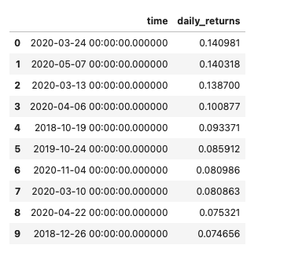

# Module 7 Challenge
## ETF Analyzer
This project contains a financial database and web application by using SQL, Python, and the Voilà library to analyze the performance of a hypothetical fintech ETF. The project analyzes the daily and cummulative return of PYPL and then combines PYPL, GDOT, GS, SQ as a single ETF to display its daily, annualized and cummulative return.

Finally the project uses the Voilà library to deploy a notebook as a web application. 
HvPlot is utilized to create interactive plots.

## Voila Images
#### Launch Voila from Terminal

#### PYPL Daily Returns Top 10 Returns Cumulative return and Plot





- - - 

## Technologies
### Libraries

The project was buildt using Python 3.7 and several python libraries listed below in a code block. A new virtual environment was created for this project because of the hvplot module.


###  Modules
```
import numpy as np
import pandas as pd
import hvplot.pandas
import sqlalchemy
```


### Database Connection String
```
database_connection_string = 'sqlite:///etf.db'
```

###  Create a Database Engine
```
engine = sqlalchemy.create_engine(database_connection_string)
```

### Confirm tables created in SQLite Database
```
engine.table_names()
```

### 
- - - 
## Installation Guide
If you need help with installing Python 3.7 please use this link to Python guides.

[Python documentation](https://docs.python.org/3.7/)


- - - 
## Contributors
This was a student project but that had criticial contributions from the head instructor and very able TA's.


- - - 
## License
Any usage of this app should be authorized from Columbia Univesity bookcamp.
